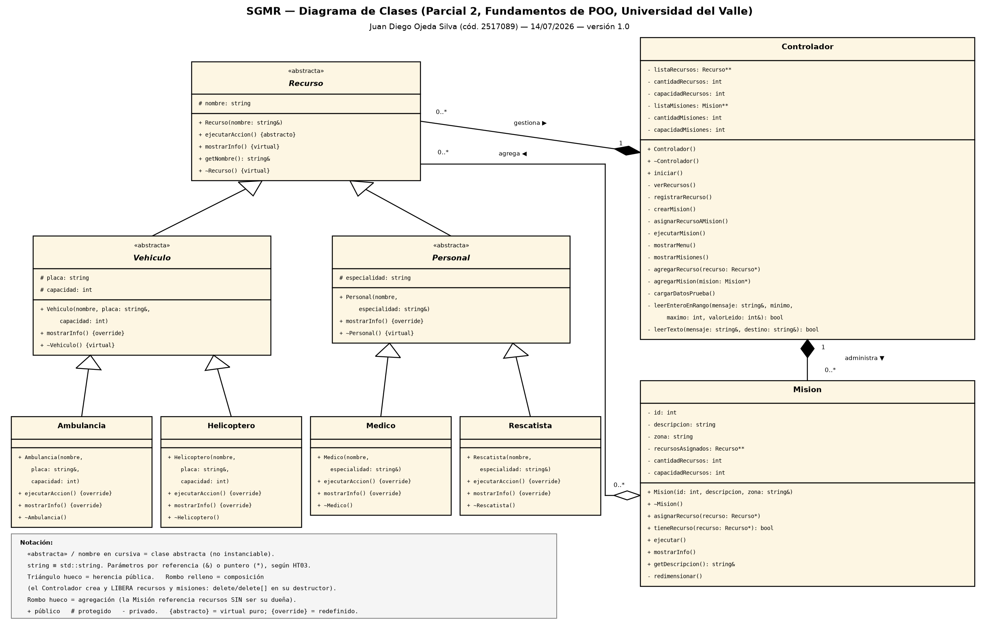
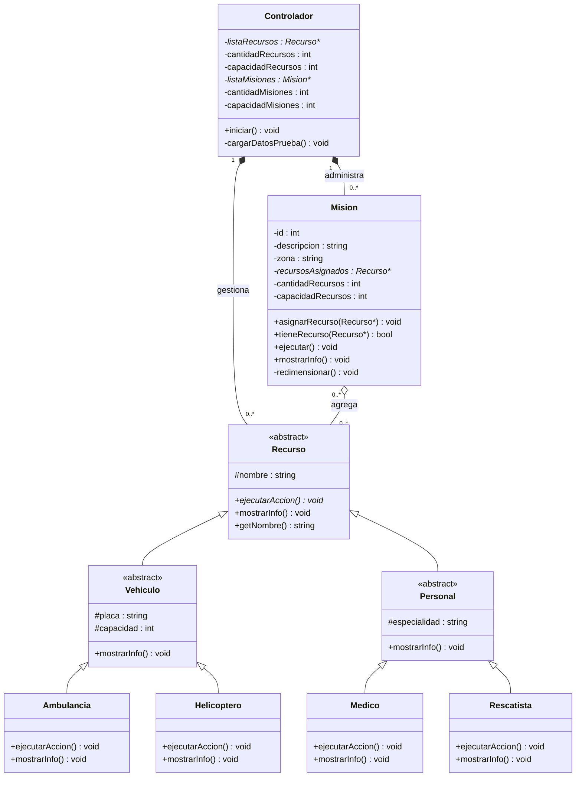

# Parcial 2 — Sistema de Gestión de Misiones de Rescate (SGMR)

**Curso:** Fundamentos de Programación Orientada a Objetos — Grupo 80, Universidad del Valle
**Estudiante:** Juan Diego Ojeda Silva — código 2517089 (entrega individual)
**Fecha:** 14 de julio de 2026

Motor lógico en C++ para el registro centralizado de recursos de rescate
(ambulancias, helicópteros, médicos y rescatistas), la creación de misiones de
emergencia y la asignación dinámica de recursos a misiones, operado desde un
menú de consola. Construido a partir de las historias de usuario HU01–HU05 y
las historias técnicas HT01–HT03 del enunciado.

## Estructura del proyecto

```
Parcial2_SGMR/
├── Codigo/
│   ├── include/        Headers (.h): Recurso, Vehiculo, Personal, Ambulancia,
│   │                   Helicoptero, Medico, Rescatista, Mision, Controlador
│   ├── src/            Implementaciones (.cpp) + main.cpp (mínimo, HU04)
│   └── tests/          Escenario de consola + test de fugas de memoria
├── diagrama/           Diagrama de clases UML (.puml fuente + .png)
└── README.md
```

## Compilación y ejecución

Desde la carpeta `Codigo/`:

```bash
# Programa principal
g++ -std=c++17 -Wall -Iinclude src/*.cpp -o sgmr.exe
./sgmr.exe

# Test de fugas de memoria (excluye src/main.cpp; -static es necesario en
# MinGW para que los operadores new/delete reemplazados cuenten también las
# asignaciones internas de libstdc++)
g++ -std=c++17 -Wall -static -static-libgcc -static-libstdc++ -Iinclude \
    src/Recurso.cpp src/Vehiculo.cpp src/Personal.cpp src/Ambulancia.cpp \
    src/Helicoptero.cpp src/Medico.cpp src/Rescatista.cpp src/Mision.cpp \
    src/Controlador.cpp tests/test_memoria.cpp -o tests/test_memoria.exe
./tests/test_memoria.exe

# Recorrido automático del menú (opcional)
./sgmr.exe < tests/escenario_completo.txt
```

Probado con g++ (MinGW-W64) 16.1.0 en Windows 11: compila limpio con
`-Wall -Wextra`, sin warnings.

## Diseño

### Jerarquía de clases (HU01, HU02, HU03)

`Recurso` (abstracta) es la raíz; `Vehiculo` y `Personal` (abstractas)
agrupan los datos comunes (placa/capacidad y especialidad); `Ambulancia`,
`Helicoptero`, `Medico` y `Rescatista` redefinen con `override` la acción
operativa virtual pura `ejecutarAccion()`. `Mision::ejecutar()` recorre su
arreglo `Recurso**` invocando `ejecutarAccion()` por puntero a la base: el
enlace dinámico produce las cuatro salidas exactas del enunciado sin ningún
`if`/`switch` por tipo (el único punto que decide tipos concretos es la
creación en `registrarRecurso()`, un factory simple inevitable).

### Propiedad de la memoria (HT01, HT02)

- **Composición** (rombo relleno en el UML): el `Controlador` es el **dueño**
  de todos los recursos y misiones; los crea con `new` y los libera en su
  destructor con `delete` y `delete[]`.
- **Agregación** (rombo hueco): cada `Mision` solo **referencia** recursos del
  inventario en su arreglo `Recurso**`; su destructor libera únicamente su
  arreglo de punteros, nunca los recursos — así se evita el doble `delete`.
- Ambas colecciones son arreglos dinámicos de punteros (`Recurso**`,
  `Mision**`) creados con `new` en el Heap y **redimensionados manualmente**
  (se crea un arreglo del doble, se copian los punteros y se libera el viejo
  con `delete[]`). No se usa `std::vector` ni ninguna otra colección STL.
- `~Recurso()` es **virtual**: garantiza la cadena correcta de destructores
  al hacer `delete` sobre punteros a la base.
- Todo paso de objetos complejos es por referencia (`&`) o puntero (`*`);
  ningún `Recurso`/`Mision` se pasa ni retorna por valor (HT03).

### Auditoría manual new ↔ delete (HT02)

| Asignación (`new`) | Se crea en | Liberación | Se libera en |
|---|---|---|---|
| `new Recurso*[cap]` (inventario) | ctor de `Controlador`; `agregarRecurso()` al redimensionar | `delete[] listaRecursos` | `~Controlador()`; arreglo viejo en `agregarRecurso()` |
| `new Mision*[cap]` | ctor de `Controlador`; `agregarMision()` al redimensionar | `delete[] listaMisiones` | `~Controlador()`; arreglo viejo en `agregarMision()` |
| `new Ambulancia/Helicoptero/Medico/Rescatista` | `cargarDatosPrueba()`, `registrarRecurso()` | `delete listaRecursos[i]` (destructor virtual) | `~Controlador()` |
| `new Mision(...)` | `cargarDatosPrueba()`, `crearMision()` | `delete listaMisiones[i]` | `~Controlador()` |
| `new Recurso*[cap]` (por misión) | ctor de `Mision`; `redimensionar()` | `delete[] recursosAsignados` | `~Mision()`; arreglo viejo en `redimensionar()` |

Tras cada `delete[]` de un atributo se asigna `nullptr` (práctica del curso).

## Datos de prueba precargados (HU05)

`cargarDatosPrueba()` (método privado, invocado por el constructor del
`Controlador`) instancia dinámicamente: **2 misiones, 2 ambulancias,
1 helicóptero, 2 médicos y 2 rescatistas**. La misión 1 queda con 4 recursos
heterogéneos ya asignados (lo que además fuerza el redimensionamiento del
arreglo interno, de capacidad inicial 2), para poder usar la opción
*5. Ejecutar misión* de inmediato; la misión 2 queda vacía para probar la
asignación desde cero.

## Verificación realizada

- **Compilación limpia:** `-Wall -Wextra`, cero warnings (g++ 16.1.0).
- **Escenario completo por consola** (`tests/escenario_completo.txt`): ver
  recursos, ejecutar misión precargada (4 salidas polimórficas exactas),
  ejecutar misión vacía, registrar helicóptero, crear misión, asignarle el
  recurso nuevo, rechazo de asignación duplicada, ejecución de la nueva
  misión, entradas inválidas (`abc`, `99`) re-preguntadas, salida con las
  11 liberaciones visibles (8 recursos + 3 misiones). Código de salida 0.
- **Robustez ante EOF:** si la entrada estándar se cierra a mitad de un
  registro, el programa avisa, sale ordenadamente y libera toda la memoria
  (sin bucles infinitos ni objetos a medio crear).
- **Cero fugas de memoria** (`tests/test_memoria.cpp`): se reemplazan los
  operadores globales `new`/`delete` por contadores y se simulan 4 sesiones
  completas del menú redirigiendo `std::cin`. Resultado: **256 news = 256
  deletes, saldo 0 en las 4 sesiones**.

## Diagrama de clases (UML)



Fuente editable: [`diagrama/Diagrama_Clases_SGMR.puml`](diagrama/Diagrama_Clases_SGMR.puml)
(renderizable en plantuml.com). Vista rápida (Mermaid):



## Notas de implementación

- Se usa `std::string` para textos: la prohibición de HT01 aplica a las
  **colecciones de alto nivel** (`std::vector`, `std::list`, etc.), que aquí
  se sustituyen íntegramente por arreglos manuales de punteros; `std::string`
  es el tipo de texto estándar usado en el material del curso.
- En Windows se activa UTF-8 en la consola (`SetConsoleOutputCP`) bajo
  `#ifdef _WIN32`, para que las tildes de los mensajes exactos del enunciado
  se muestren correctamente; en Linux no interviene.
- La lectura del menú usa `std::getline` + validación (dígitos, rango,
  longitud) y re-pregunta ante entrada inválida; el cierre de la entrada
  (EOF) dispara una salida ordenada equivalente a la opción 6.
